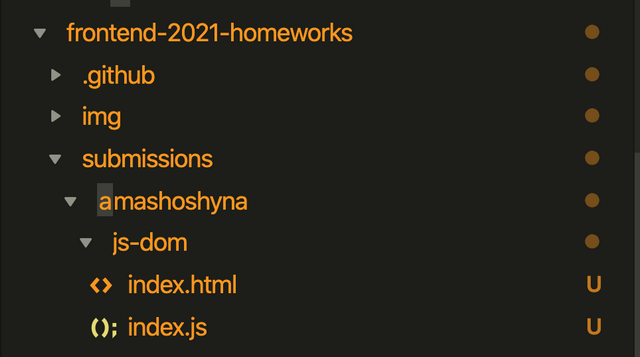

[![MIT Licensed][icon-mit]][license]
[![Kottans-Frontend][icon-kottans]][kottans-frontend]
&nbsp;&nbsp;&nbsp;&nbsp;&nbsp;&nbsp;
[![Telegram][icon-chat]][chat]

# Frontend 2021 course homeworks

This repo was created for students to submit their homeworks for review.

### How to submit

- fork this repository
- clone your fork to your local machine: `git clone https://github.com/YOUR_USERNAME/frontend-2021-homeworks.git`
- add this repository as an upstream: `git remote add upstream https://github.com/kottans/frontend-2021-homeworks.git`
- in your local repository, add a folder with your github name under `submissions` (if you haven't yet)
- in your local repository, under your name folder, add a folder with task name and put your code in the folder
  (IMPORTANT! Put only code required to conduct review, i.e. `html`, `css`, `js` files and such;
  images, IDE directories like `.idea`, `.vscode` etc are not required for code review;
  never have `.git` directory in your task submissions)
  
It is recommended that you have dedicated projects/repositories for your tasks code, and only certain files
are copied here for review.

  See example file structure you are expected to have below:

  

- make pull-request to this repository following these steps:
  - `git checkout main` and then create new branch, name it according to task performed (aka feature branch): `git checkout -b dom-api-task`. In this example feature branch is called `dom-api-task`
  - commit your changes to newly created feature branch
  - checkout `main` branch: `git checkout main`
  - pull latest changes from upstream `main` branch: `git pull upstream main`
  - merge `main` branch into your feature branch: `git checkout dom-api-task && git merge main`
  - resolve any merge conflicts if there are any
  - push feature branch to your remote repository: `git push --set-upstream origin dom-api-task`
  - make pull-request from your repository to this repository via GitHub web-interface
- post a link to your subtask PR in the
  [FE Questionarium chat](https://t.me/joinchat/DmX0JAl-mh5W0jrWli8Ycw)
  and ask mentors and peers for a code review
  - wait for review
  - if necessary, make changes, until your code will be approved and merged
  - list your reflections on this subtask
    (_what was new to you_, _what surprised you_, _what you intend to use in future_)

[icon-mit]: https://img.shields.io/badge/license-MIT-blue.svg
[license]: https://github.com/OleksiyRudenko/a-tiny-JS-world/blob/master/LICENSE.md
[icon-chat]: https://img.shields.io/badge/chat-on%20telegram-blue.svg
[icon-kottans]: https://img.shields.io/badge/%3D(%5E.%5E)%3D-frontend-yellow.svg
[kottans-frontend]: https://github.com/kottans/frontend
[chat]: https://t.me/joinchat/DmX0JAl-mh5W0jrWli8Ycw
