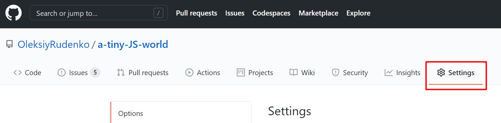
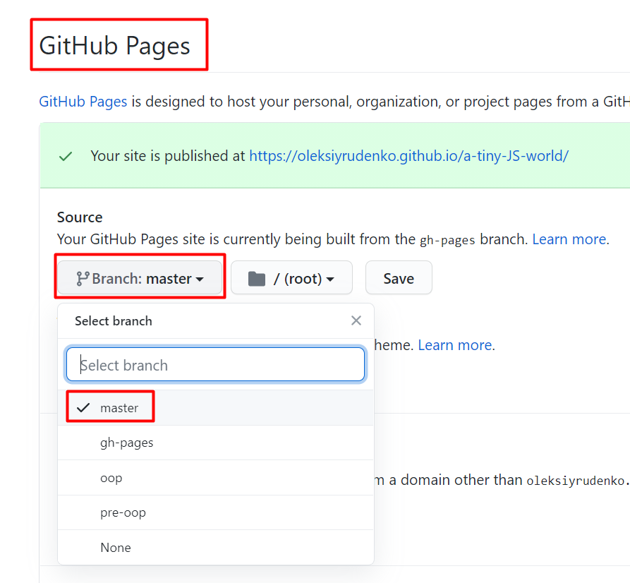
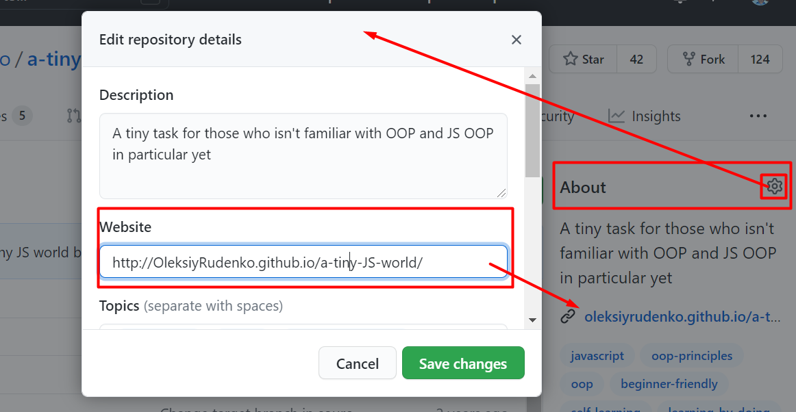

# Publish your app on GitHub Pages

A method to publish a web app that doesn't require building or bundling.

## Pre-requisites

- You have a dedicated project for your app on GitHub.
  Example: https://github.com/OleksiyRudenko/a-tiny-JS-world
- Your app has `index.html` in the project root
- Styles and scripts are referred to in `index.html` 

## Publication

1. Navigate to project Settings

2. Scroll down till the **GitHub Pages** section and select a branch
   to be a source of your publication.

You will want to select either `master` or `main`
(depending on what default branch is in your project)
or `gh-pages` (historical branch for projects publishing).

You will find an url to the app publication in a green shaded area.

3. Use the url as an input to your project website setting and
   for sharing with others
   

